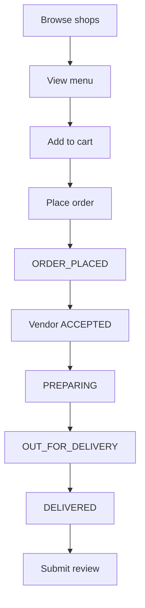

# GutFriendly Business Flows

End-to-end lifecycle documentation for frontend and QA. Each flow lists API triggers and state transitions.

---

## 1. Vendor Onboarding Flow

```mermaid
flowchart TD
    A[POST /vendor/register] --> B[POST /vendor/login]
    B --> C[POST /vendor/{id}/shops]
    C --> D[POST .../location]
    D --> E{Pincode in whitelist?}
    E -->|No| F[400 - not serviceable]
    E -->|Yes| G[Shop SERVICEABLE]
    G --> H[POST .../inspections/book]
    H --> I[Inspection SCHEDULED]
    I --> J[Admin assigns inspector]
    J --> K[ASSIGNED]
    K --> L[Inspector starts]
    L --> M[IN_PROGRESS]
    M --> N[Inspector submits report]
    N --> O[REPORT_SUBMITTED]
    O --> P[Admin reviews]
    P --> Q[UNDER_ADMIN_REVIEW]
    Q --> R{Decision}
    R -->|Approve| S[Shop VERIFIED]
    R -->|Reject| T[Shop REJECTED]
    R -->|Reinspect| U[New SCHEDULED]
    S --> V[Manage menu + receive orders]
```

### Step-by-step

| Step | API | State change |
|------|-----|--------------|
| 1. Register | `POST /vendor/register` | Vendor created (`isActive=true`) |
| 2. Login | `POST /vendor/login` | Returns vendor + shops |
| 3. Create shop | `POST /vendor/{vendorId}/shops` | `ShopStatus.PENDING`, `NOT_SERVICEABLE` |
| 4. Save location | `POST .../location` | Address saved; if pincode valid → `SERVICEABLE` |
| 5. Book inspection | `POST .../inspections/book` | `InspectionStatus.SCHEDULED` |
| 6. Wait | Poll `GET .../dashboard` | `nextAction`: "Wait for inspector assignment" |
| 7. Admin assigns | `PATCH /admin/inspections/{id}/assign/{inspectorId}` | `SCHEDULED → ASSIGNED` |
| 8. Inspector works | Inspector APIs | `ASSIGNED → IN_PROGRESS → REPORT_SUBMITTED` |
| 9. Admin review | `PATCH .../review` | `REPORT_SUBMITTED → UNDER_ADMIN_REVIEW` |
| 10. Approve | `PATCH .../approve` | `APPROVED`; shop `VERIFIED`; trust scores updated |
| 11. Go live | Menu + orders APIs | Users can order from VERIFIED shop |

### Rejection path
- `PATCH .../reject` → shop `REJECTED`, `NOT_SERVICEABLE`
- Vendor must fix issues and book re-inspection or admin sends `PATCH .../reinspection`

---

## 2. User Order Flow



### APIs

| Step | API | Rules |
|------|-----|-------|
| Browse | `GET /shops`, `/home/user/{id}` | Only VERIFIED, non-blocked shops |
| Menu | `GET /foods/shop/{shopId}` | Shop must be VERIFIED |
| Cart | `POST /cart/user/{id}/items` | Single shop; food available |
| Order | `POST /orders/user/{id}` | Shop verified, open, online; cart not empty |
| Track | `GET /orders/user/{id}/{orderId}` | `orderStatus` field |
| Cancel | `PUT .../cancel` | Only when `PLACED` |
| Review | `POST /reviews/user/{id}` | Only when `DELIVERED`; one per order |

### Order status mapping

| User (`OrderStatus`) | Vendor (`ShopOrderStatus`) | DB (`Status`) |
|---------------------|---------------------------|---------------|
| PLACED | NEW | ORDER_PLACED |
| ACCEPTED | ACCEPTED | ACCEPTED |
| PREPARING | PREPARING | PREPARING |
| OUT_FOR_DELIVERY | OUT_FOR_DELIVERY | OUT_FOR_DELIVERY |
| DELIVERED | DELIVERED | DELIVERED |
| CANCELLED | CANCELLED | CANCELLED |

**Valid vendor transitions:** linear chain only; no skipping steps.

---

## 3. Inspection Lifecycle (State Machine)

```
SCHEDULED
    │  PATCH /admin/inspections/{id}/assign/{inspectorId}
    ▼
ASSIGNED
    │  PATCH /inspector/inspection/{id}/start
    ▼
IN_PROGRESS
    │  POST .../test-results (one or more)
    │  PATCH .../submit
    ▼
REPORT_SUBMITTED
    │  PATCH /admin/inspections/{id}/review
    ▼
UNDER_ADMIN_REVIEW
    ├─ PATCH .../approve        → APPROVED (shop VERIFIED)
    ├─ PATCH .../reject         → REJECTED
    └─ PATCH .../reinspection   → CLOSED_FOR_REINSPECTION + new SCHEDULED
```

**Guards:** Each transition validates current status; invalid transitions return `409 Conflict`.

---

## 4. Trust Score Flow

### Inspection approval
1. `inspection.overallInspectionScore` → `shop.inspectionTrustScore`
2. `GutTrustScoreService.recalculateFinalScore(shopId)`
3. Formula: `final = 70% inspection + 30% user` (or single component if other is 0)

### User review
1. User submits review for delivered order
2. `shop.userTrustScore` = average of active review ratings
3. `recalculateFinalScore(shopId)` again
4. User earns reward points based on review type/keywords

---

## 5. Shop Visibility Rules

| Actor | Rule |
|-------|------|
| User browse | `status == VERIFIED` AND `blocked == false` |
| User order | Above + `onlineOrdersEnabled == true` + `isOpen == true` |
| Admin browse | All shops (paginated, filterable) |
| Vendor | Own shops only (via `vendorId` path) |

---

## 6. Cart Business Rules

1. All items must be from the **same shop**
2. Food must have `available = true`
3. Quantity must be > 0
4. Cart cleared after successful order placement
5. Order uses cart items to create `OrderItems` with price snapshot

---

## 7. Review Business Rules

1. Order must belong to user
2. Order status must be `DELIVERED`
3. One review per order (`unique` on `order_id`)
4. Rating 1–5 required
5. Keywords optional (`ReviewKeyword` enum)
6. Review type auto-determined from keywords
7. Reward points granted on submit
8. Vendor cannot reply (read-only vendor review APIs)

---

## 8. Admin Shop Management

| Action | API | Effect |
|--------|-----|--------|
| List all | `GET /admin/shops` | Paginated |
| Filter pending | `GET /admin/shops/status/PENDING` | Pre-verification shops |
| Block | `PATCH /admin/shops/{id}/block` | `blocked=true`, `NOT_SERVICEABLE` |
| Unblock | `PATCH /admin/shops/{id}/unblock` | `blocked=false`, `SERVICEABLE` |

---

## 9. Payment Flow (stub)

| Method | On place order | On deliver |
|--------|----------------|------------|
| COD | `paymentStatus` pending | Set `SUCCESS` when DELIVERED |
| ONLINE | `paymentStatus` pending | No gateway — manual status update only |

`UserPaymentStatus` entity exists but is **not created** during order placement.

---

## 10. Payout Flow (vendor)

Read-only APIs:
- `GET .../payouts/summary` — balances
- `GET .../payouts` — history

No payout initiation API — display only.

---

## Frontend Polling Recommendations

| Page | Poll interval | Endpoint |
|------|---------------|----------|
| Vendor orders | 15–30s | `GET .../orders?status=active` |
| User order tracking | 15–30s | `GET /orders/user/{id}/{orderId}` |
| Vendor inspection wait | 60s | `GET .../dashboard` (check `nextAction`) |
| Admin inspection queue | 30s | `GET /admin/inspections/status/REPORT_SUBMITTED` |

No WebSocket support.
