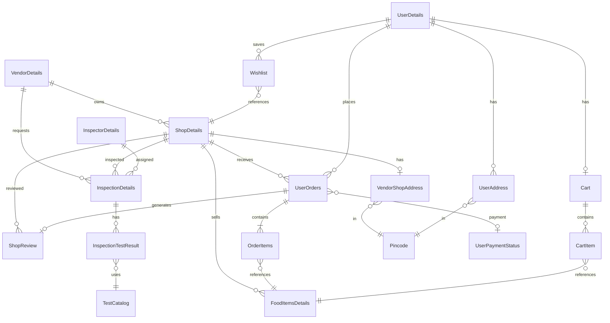

# GutFriendly Database Schema

Derived from JPA entity annotations. Hibernate `ddl-auto=update` manages schema at runtime.

**Database:** MySQL `gutfriendly` @ `localhost:3306`

---

## Entity Relationship Diagram

---

## Tables

### vendor_details
| Column | Type | Constraints |
|--------|------|-------------|
| vendor_id | INT | PK, auto-increment |
| f_name, m_name, l_name | VARCHAR | |
| phone_no | VARCHAR | UNIQUE |
| password | VARCHAR | plaintext |
| email | VARCHAR | UNIQUE |
| adhar_no | VARCHAR | UNIQUE |
| pan_no | VARCHAR | UNIQUE |
| joining_date | TIMESTAMP | |
| is_active | BOOLEAN | |

### shop_details
| Column | Type | Constraints |
|--------|------|-------------|
| shop_id | INT | PK |
| shop_name | VARCHAR | |
| gst_no | VARCHAR | UNIQUE |
| category | ENUM | Category |
| user_trust_score | DOUBLE | |
| inspection_trust_score | DOUBLE | |
| final_gut_trust_score | DOUBLE | |
| vendor_id | INT | FK → vendor_details |
| address_id | INT | FK → vendor_shop_address, nullable |
| status | ENUM | ShopStatus (PENDING, VERIFIED, REJECTED, …) |
| blocked | BOOLEAN | |
| service_availability_status | ENUM | SERVICEABLE / NOT_SERVICEABLE |
| is_open | BOOLEAN | |
| online_orders_enabled | BOOLEAN | |
| open_time, close_time | TIME | |
| estimated_prep_time_minutes | INT | |
| rating | DOUBLE | |
| rating_count | BIGINT | |
| image_url | VARCHAR | |
| admin_remarks | VARCHAR | |
| verified_at | TIMESTAMP | |
| created_at | TIMESTAMP | |
| last_calculated_at | TIMESTAMP | |

### vendor_shop_address
| Column | Type | Constraints |
|--------|------|-------------|
| address_id | INT | PK |
| shop_number, locality | VARCHAR | |
| pin_code | VARCHAR | FK → pincode |

### pincode
| Column | Type | Constraints |
|--------|------|-------------|
| pin_code | VARCHAR | PK |
| city, state | VARCHAR | |

### food_items_details
| Column | Type | Constraints |
|--------|------|-------------|
| food_id | INT | PK |
| shop_id | INT | FK → shop_details, NOT NULL |
| food_name | VARCHAR | |
| price | DOUBLE | |
| food_desc | VARCHAR | |
| food_category | VARCHAR | |
| available | BOOLEAN | |
| created_at, updated_at | TIMESTAMP | NOT NULL |

### food_images
| Column | Type | Constraints |
|--------|------|-------------|
| image_id | INT | PK |
| food_id | INT | FK |
| image_url | VARCHAR | |

### shop_images
| Column | Type | Constraints |
|--------|------|-------------|
| image_id | INT | PK |
| shop_id | INT | FK |
| image_url | VARCHAR | |

---

### user_details
| Column | Type | Constraints |
|--------|------|-------------|
| user_id | INT | PK |
| f_name, l_name | VARCHAR | |
| phone_no | VARCHAR | UNIQUE |
| email | VARCHAR | UNIQUE |
| password | VARCHAR | plaintext |
| joining_date | TIMESTAMP | |
| is_active | BOOLEAN | |
| trusted_user | BOOLEAN | |
| reward_points | INT | |

### user_address
| Column | Type | Constraints |
|--------|------|-------------|
| address_id | INT | PK |
| user_id | INT | FK, NOT NULL |
| locality | VARCHAR | |
| address_type | ENUM | |
| pin_code | VARCHAR | FK → pincode |

### cart
| Column | Type | Constraints |
|--------|------|-------------|
| cart_id | INT | PK |
| user_id | INT | FK, UNIQUE, NOT NULL |
| created_at, updated_at | TIMESTAMP | |

### cart_item
| Column | Type | Constraints |
|--------|------|-------------|
| cart_item_id | INT | PK |
| cart_id | INT | FK, NOT NULL |
| food_id | INT | FK, NOT NULL |
| quantity | INT | |
| unit_price | DECIMAL | |
| | | UNIQUE(cart_id, food_id) |

### wishlist
| Column | Type | Constraints |
|--------|------|-------------|
| wishlist_id | INT | PK |
| user_id | INT | FK, NOT NULL |
| shop_id | INT | FK, NOT NULL |
| created_at | TIMESTAMP | |
| | | UNIQUE(user_id, shop_id) |

---

### user_orders
| Column | Type | Constraints |
|--------|------|-------------|
| order_id | INT | PK |
| status | ENUM | Status (ORDER_PLACED, ACCEPTED, …) |
| user_id | INT | FK, NOT NULL |
| shop_id | INT | FK, NOT NULL |
| payment_id | INT | FK → user_payment_status, nullable |
| delivery_address | VARCHAR | |
| total_amount | DECIMAL | |
| payment_method | VARCHAR | COD / ONLINE |
| payment_status | VARCHAR | PENDING / SUCCESS / REFUNDED |
| ordered_at | TIMESTAMP | |
| updated_at | TIMESTAMP | |
| delivered_at | TIMESTAMP | nullable |

### order_items
| Column | Type | Constraints |
|--------|------|-------------|
| order_item_id | INT | PK |
| order_id | INT | FK, NOT NULL |
| food_id | INT | FK, NOT NULL |
| food_name | VARCHAR | denormalized |
| quantity | INT | |
| price | DOUBLE | snapshot |
| item_total | DECIMAL | |

### user_payment_status
| Column | Type | Constraints |
|--------|------|-------------|
| payment_id | INT | PK |
| amount | DOUBLE | NOT NULL |
| payment_mode | ENUM | CASH, UPI, CARD, WALLET |
| payment_status | ENUM | PENDING, PAID, FAILED |
| user_id | INT | FK, NOT NULL |
| transaction_id | VARCHAR | |
| payment_gateway | VARCHAR | |
| payment_date | TIMESTAMP | |

**Note:** Not wired in order placement flow.

---

### shop_reviews
| Column | Type | Constraints |
|--------|------|-------------|
| review_id | INT | PK |
| order_id | INT | FK, UNIQUE, NOT NULL |
| user_id | INT | FK, NOT NULL |
| shop_id | INT | FK, NOT NULL |
| rating | INT | 1–5 |
| comment | TEXT | |
| review_type | ENUM | |
| points_awarded | INT | |
| active | BOOLEAN | |
| reward_granted | BOOLEAN | |
| created_at, updated_at | TIMESTAMP | |

### review_keywords
| Column | Type | Constraints |
|--------|------|-------------|
| review_id | INT | FK |
| keyword | VARCHAR | ElementCollection |

### user_reviews (legacy)
| Column | Type | Notes |
|--------|------|-------|
| review_id | INT | PK |
| user_id, shop_id, order_item_id | INT | FKs |
| review_type | ENUM | DiningReviewType |
| calculated_trust_score | DOUBLE | |
| taste_rating, freshness_rating, … | INT | Multiple rating dimensions |
| review | TEXT | |
| created_at | TIMESTAMP | |

Used by admin dashboard recent-activities only. User-facing reviews use `shop_reviews`.

---

### inspection_details
| Column | Type | Constraints |
|--------|------|-------------|
| inspection_id | INT | PK |
| vendor_id | INT | FK, NOT NULL |
| shop_id | INT | FK, NOT NULL |
| inspector_id | INT | FK, nullable until assigned |
| inspection_date | TIMESTAMP | |
| completed_at | TIMESTAMP | |
| status | ENUM | InspectionStatus |
| overall_inspection_score | DOUBLE | |
| recommendation | ENUM | InspectorRecommendation |
| inspector_remarks | TEXT | |
| admin_remarks | TEXT | |
| reviewed_by_admin | BOOLEAN | |
| reviewed_at | TIMESTAMP | |

### inspector_details
| Column | Type | Constraints |
|--------|------|-------------|
| inspector_id | INT | PK |
| first_name, last_name | VARCHAR | |
| employee_code | VARCHAR | |
| phone_no, email | VARCHAR | |
| password | VARCHAR | |
| status | ENUM | InspectorStatus |
| experience_in_years | INT | |
| assigned_city, assigned_zone | VARCHAR | |
| designation | ENUM | |
| address | VARCHAR | |
| joining_date | TIMESTAMP | |

### test_catalog
| Column | Type | Constraints |
|--------|------|-------------|
| test_id | INT | PK |
| category | ENUM | FoodCategory |
| product_name, test_title | VARCHAR | |
| adulterant_name | VARCHAR | |
| testing_method | TEXT | |
| positive_indicator, negative_indicator | TEXT | |
| equipment_required | TEXT | |
| reference_image_pure, reference_image_adulterated | VARCHAR | |
| max_score | DOUBLE | |
| active | BOOLEAN | |

### inspection_test_result
| Column | Type | Constraints |
|--------|------|-------------|
| result_id | INT | PK |
| inspection_id | INT | FK |
| test_id | INT | FK |
| sample_type | ENUM | FoodSampleType |
| sample_description | TEXT | |
| quantity_sample_taken | VARCHAR | |
| outcome | ENUM | TestOutcome |
| observation_notes | TEXT | |
| score_awarded | DOUBLE | |
| tested_at | TIMESTAMP | |
| action_taken | ENUM | InspectionActionTaken |
| lab_reference_no | VARCHAR | |

---

### admin_details
| Column | Type | Constraints |
|--------|------|-------------|
| id | INT | PK |
| first_name, last_name | VARCHAR | |
| email | VARCHAR | UNIQUE |
| password | VARCHAR | |
| phone_no | VARCHAR | |
| created_at | TIMESTAMP | |
| last_login | TIMESTAMP | |
| is_active | BOOLEAN | |

### certificate
| Column | Type | Constraints |
|--------|------|-------------|
| certificate_id | INT | PK |
| shop_id | INT | FK |
| issue_date, expiry_date | DATE | |
| certificate_url | VARCHAR | |

No REST API — entity used in admin dashboard only.

### shop_payout
| Column | Type | Constraints |
|--------|------|-------------|
| payout_id | INT | PK |
| shop_id | INT | FK |
| amount | DECIMAL | |
| status | ENUM | PayoutStatus |
| period_start, period_end | DATE | |
| processed_at | TIMESTAMP | |

---

## Indexes

No explicit `@Index` annotations declared. Consider adding indexes on:
- `shop_details.status`, `shop_details.vendor_id`
- `user_orders.shop_id`, `user_orders.user_id`, `user_orders.status`
- `inspection_details.status`, `inspection_details.shop_id`
- `shop_reviews.shop_id`

---

## Cascade & Orphan Rules

| Parent | Child | Cascade | Orphan removal |
|--------|-------|---------|----------------|
| UserOrders | OrderItems | ALL | yes |
| Cart | CartItem | ALL | yes |
| InspectionDetails | InspectionTestResult | ALL | yes |
| InspectionDetails | InspectionImages | ALL | yes |
| FoodItemsDetails | FoodImages | ALL | yes |
| ShopDetails | ShopImages | none | no |

---

## Enum Reference

### ShopStatus
`PENDING`, `VERIFIED`, `REJECTED`, `SUSPENDED`

### InspectionStatus
`SCHEDULED`, `ASSIGNED`, `IN_PROGRESS`, `REPORT_SUBMITTED`, `UNDER_ADMIN_REVIEW`, `APPROVED`, `REJECTED`, `CLOSED_FOR_REINSPECTION`

### Order Status (DB: `Status`)
`ORDER_PLACED`, `ACCEPTED`, `PREPARING`, `OUT_FOR_DELIVERY`, `DELIVERED`, `CANCELLED`

### PaymentMethod
`COD`, `ONLINE`

### Category (shop)
`RESTAURANT`, `CAFE`, `BAKERY`, `SWEETS`, `JUICE_BAR`, `STREET_FOOD`

---

## Data Integrity Notes

1. **Single shop per cart** — enforced in `CartService`, not DB constraint
2. **One review per order** — `UNIQUE(order_id)` on `shop_reviews`
3. **One cart per user** — `UNIQUE(user_id)` on `cart`
4. **Pincode whitelist** — `pincode` table is canonical serviceability source
5. **Trust scores** — denormalized on `shop_details`; recalculated on review/inspection approval
6. **Price snapshots** — `order_items.price` and `food_name` captured at order time
